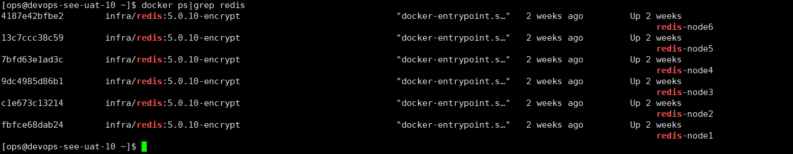

####docker连接redis

#####1、docker ps|grep redis 
######查看redis服务名称（NAMES）及节点个数，一般一主一从。

#####2、docker inspect {服务名称} 
######可查到有关该容器的信息，本次grep主要查看redis节点端口号（PORT）

#####3、docker exec -it {服务名称} bash
######进入容器执行操作

#####4、redis-cli -c -h 127.0.0.1 -p {port}
######redis客户端连接登录

#####5、auth {服务器密码}
######鉴权操作

#####5、cluster nodes
######查看集群信息，查找主从节点。本次主要获取主节点信息：主节点端口。

#####6、exit
#####7、redis-cli -c -h ip(换为已知ip) -p port(换master端口)
######退出到上一级并切换至主节点的redis客户端连接

#####8、keys {查找路径或内容}
###### redis中 keys pattern 模糊查找key

#####9、del key 
###### 手动删除单个key

