### 黑盒测试
##### 为了特定的目的而设计的一组有测试输入、执行条件、预期结果的案例（文档）。

#### 用例构成要素
##### 用例编号、用例标题、测试项目、用例级别、预置条件、测试输入、执行步骤、预期结果

#### 黑盒测试主要设计方法
###### 1、等价类 2、边界值 3、判定表 4、因果图 5、正交实验 6、状态迁移法 7、场景法 8、错误推测
#####1、等价类
#####在所有的测试数据中，具有某种共同特征的数据子集，一般按照有效等价类和无效等价类。
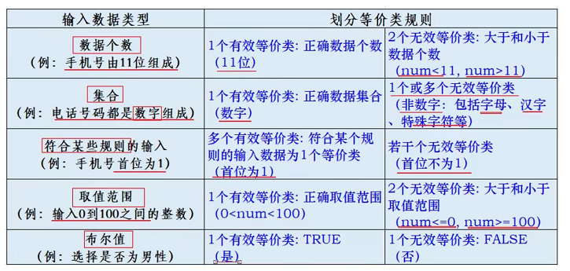

分析：输入数据、输入数据类型

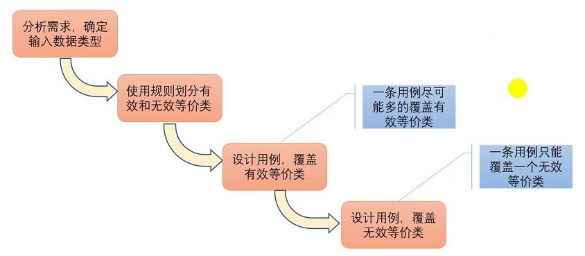

例子：

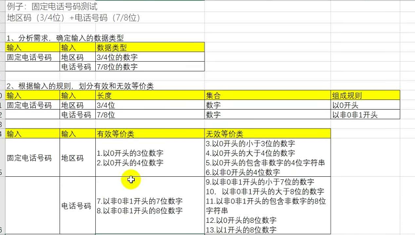

#####2、边界值
#####选取正好等于、刚刚好大于或刚刚好小于边界值作于测试数据。
#####注意：大量的错误是发生在输入或输出范围的边界上，而不是在输入范围的内部。
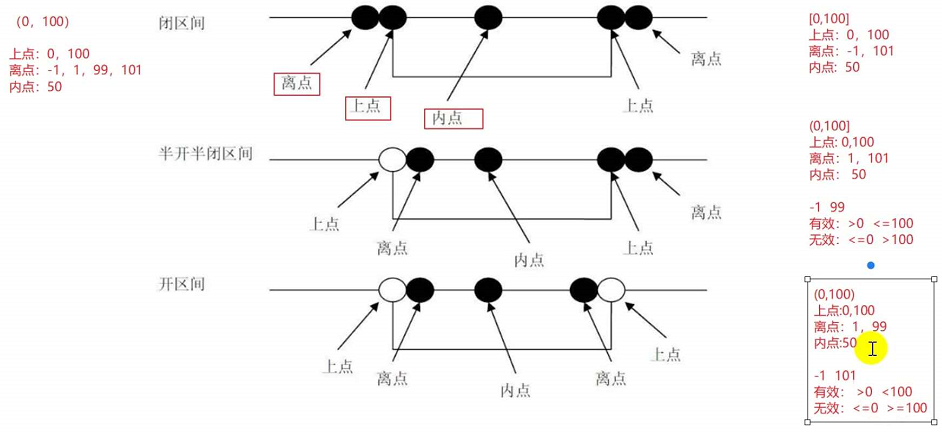

#####3、判定表
##### 多个输入时判断最终单个/多个动作全组合的规则表。且多个条件桩<=3。
#####条件桩：所有的输入的组合（单/多个）
#####条件项：不同输入条件的组合
#####动作桩：所有的输出的组合（单/多个）
#####动作项：不同输入条件的组合的结果
#####规则：一组条件与所得结果的组合，一个规则就是一个测试用例。
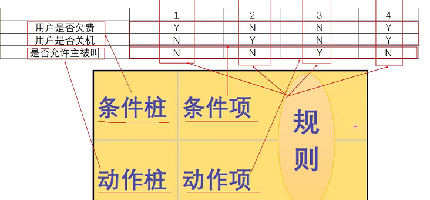

判定表法设计用例的步骤：

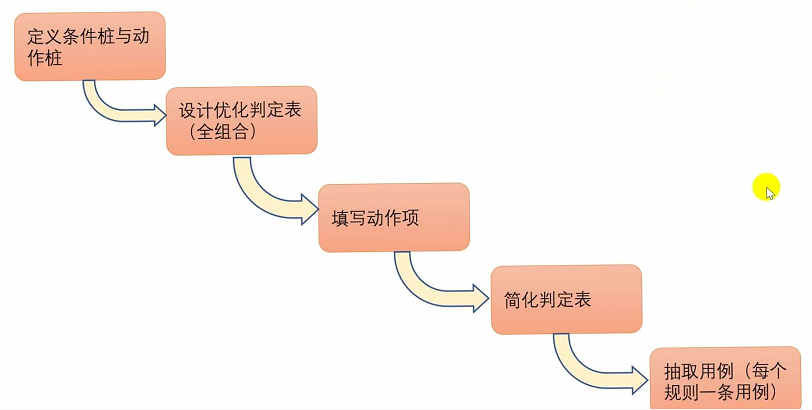

#####4、因果图
###### 对3判断表的相似场景进行组合归类。当规则过多时，可选择画出因果图。
##### 分析因果关系，首先考虑条件及条件间的关系，后考虑条件与结果间的关系，再转换为因果图。
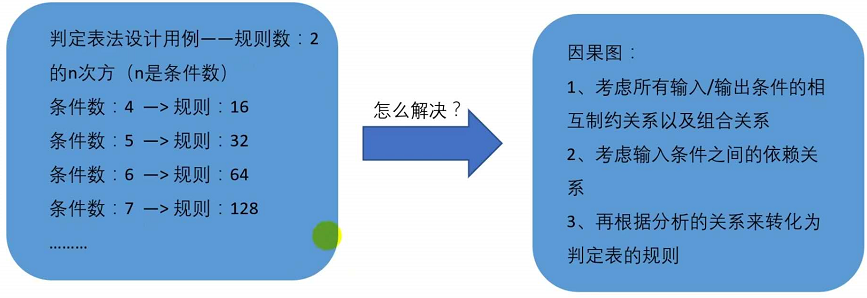

#####判定表和因果图之间的关系：恒等、非、或、且
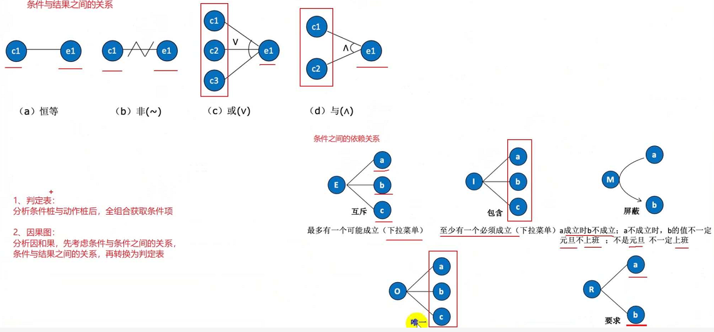

例子： 注意X

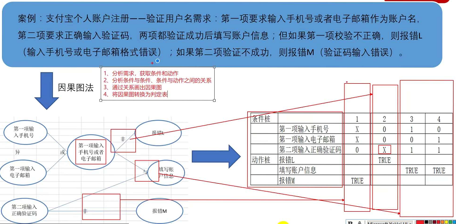

#####5、正交实验
##### 由数理统计学科中正交实验方法进化的在一种多条件、多输入的用例设计方法。从大量的数据中挑取适量的、有代表性的点，从而合理地安排测试设计方法。
##### 条件称之为因子，取值（可选择的选项）称之为水平

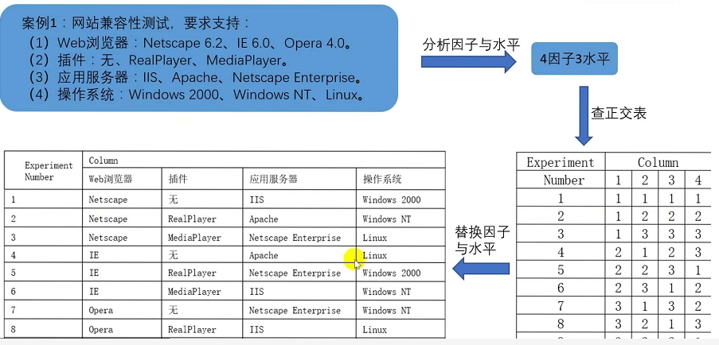

#####6、状态迁移法
##### 首先找到所有的状态，分析各个状态之间的转换【条件】和转换【路径】，然后通过转换路径覆盖的角度来设计测试用例。
##### 1、明确状态节点 2、绘制状态迁移图 3、绘制状态迁移树 4、抽取路径
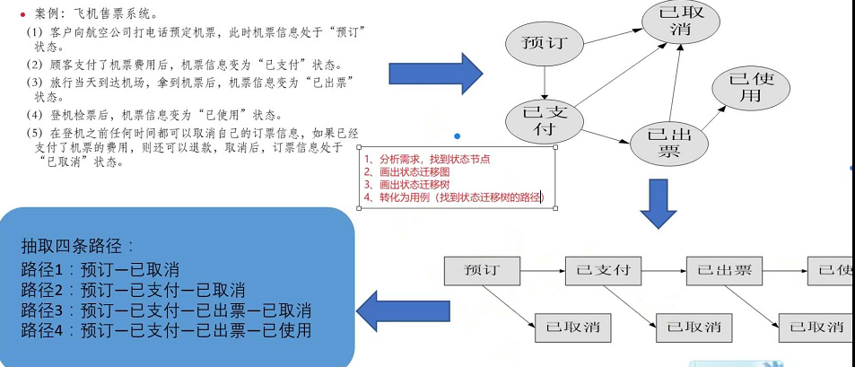

#####7、场景法
##### 软件一般都是通过事件触发来控制流程的，事件触发时的情景便称之为场景。同一事件不同的触发顺序和处理结果便形成了不同的场景。
##### 1、分析需求，选出基本流和备选流。2、根据基本流和备选流生成场景。3、根据场景生成用例。
##### 基本流、备选流、异常流
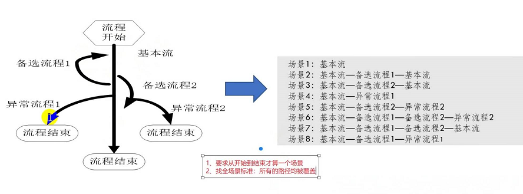

例子：

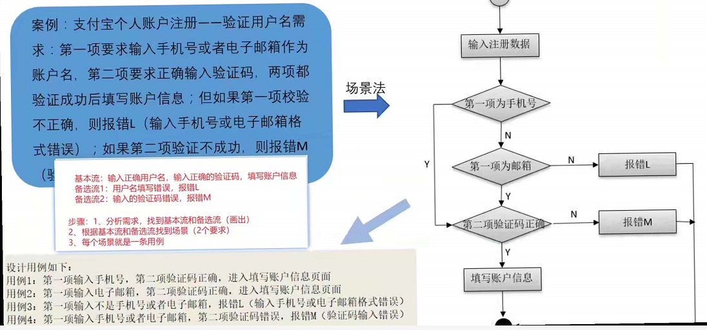

#####8、错误推测
##### 错误推测=经验+直觉 =>针对性的测试用例
##### 常用于对整个系统常容易出现的问题，或是相似问题进行总结并试探。

###小结
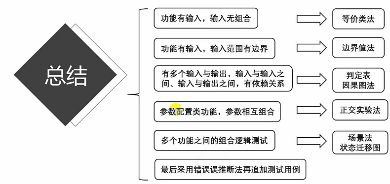

